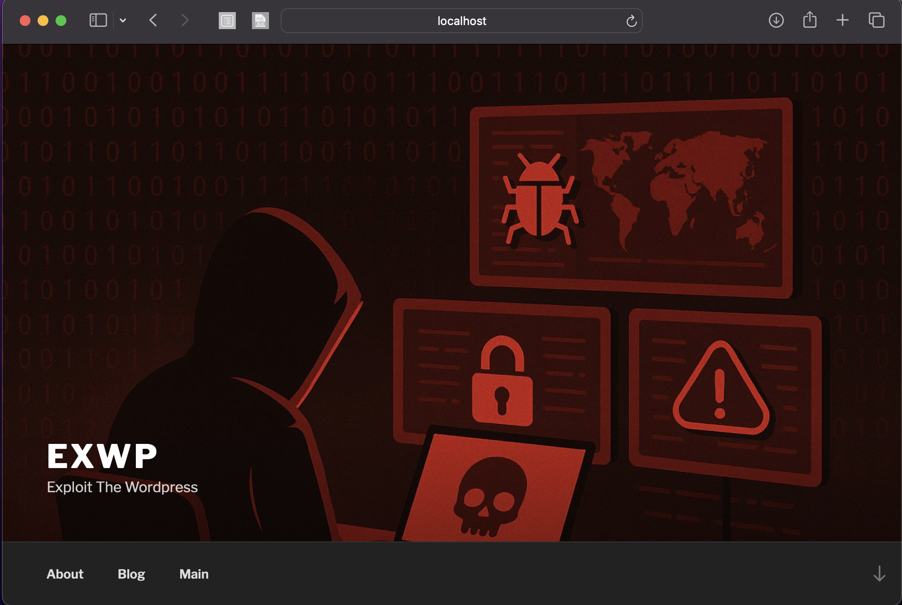

#  Exwp

A vulnerable WordPress lab built using Docker, designed for learning web security testing.  
Developed by Muhammed Farish | Security Researcher.

---

## 📸 Screenshot

### 🏠 WordPress Homepage



---

## 🚀 Quick Start

> ⚠️ Prerequisite: Docker & Docker Compose must be installed.

### 🔧 Run the Lab

```bash
git clone https://github.com/muhamedfarish/exwp.git
cd exwp
docker-compose up
```

Visit the web:
http://localhost:8111
